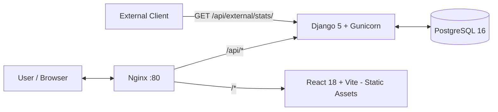

# TodoApp

> Full-stack task management web application with JWT authentication, user sharing, categories, public API, and automated deployment on AWS.

---

## Index

1. [Overview](#1-overview)
2. [Features](#2-features)
3. [Architecture](#3-architecture)
4. [Stack](#4-stack)
5. [Running Locally](#5-running-locally)
6. [Environment Variables](#6-environment-variables)
7. [Testing](#7-testing)
8. [API](#8-api)
9. [CI/CD](#9-cicd)
10. [AWS EC2 Deployment](#10-aws-ec2-deployment)
11. [Design Decisions](#11-design-decisions)

---

## 1. Overview

TodoApp is a robust and modern task list application built with Django REST Framework on the backend and React 18 on the frontend. The project demonstrates development best practices, including automated testing, containerization, and continuous integration with cloud deployment (AWS EC2).

Default access credentials (automatically seeded):

| User | E-mail | Password |
|---|---|---|
| Developer | dev@example.com | password123 |
| Tester | tester@example.com | password123 |
| Manager | manager@example.com | password123 |

---

## 2. Features

- **Authentication** — registration, login, and refresh via JWT (access + refresh tokens)
- **Tasks** — full CRUD with infinite scroll, completion toggle, and optimistic updates
- **Categories** — creation and management of categories per user
- **Sharing** — share tasks with other users via email
- **Filters** — by status, priority, category, date range, and text search
- **Profile** — update name, email, and password
- **Public API** — global statistics endpoint without authentication (`/api/external/stats/`)
- **API Documentation** — Swagger UI and ReDoc automatically generated via drf-spectacular
- **Internationalization** — support for Portuguese and English with automatic browser detection
- **Themes** — light and dark mode
- **Responsive Design** — mobile and desktop via Tailwind CSS

---

## 3. Architecture



Nginx acts as the single entry point on port 80, routing:
- `/api/*` requests to the Django backend via Gunicorn
- everything else to React static assets

All orchestration is done via Docker Compose in an isolated network.

---

## 4. Stack

| Layer | Technologies |
|---|---|
| Backend | Python 3.12, Django 5, Django REST Framework, SimpleJWT, drf-spectacular, PostgreSQL 16 |
| Frontend | React 18, TypeScript, Vite, Axios, React Query, React Hook Form, Tailwind CSS, i18next |
| Testing | pytest, pytest-django, pytest-cov, Selenium, webdriver-manager |
| Infra | Docker, Docker Compose, Nginx, Gunicorn, GitHub Actions, AWS EC2 |

---

## 5. Running Locally

### Prerequisites

- Docker and Docker Compose installed

### With Docker (recommended)

```bash
git clone https://github.com/[your-user]/todoapp.git
cd todoapp
docker-compose up --build
```

The database is automatically migrated and seeded on the first run. No manual `.env` configuration is required for the development environment — `docker-compose.yml` already includes safe default values.

| Service | URL |
|---|---|
| Frontend | http://localhost:3000 |
| Backend | http://localhost:8000 |
| Swagger UI | http://localhost:8000/api/docs/swagger-ui/ |
| ReDoc | http://localhost:8000/api/docs/redoc/ |

To seed the database manually:

```bash
docker-compose run --rm backend python manage.py seed_db
```

### Without Docker (local development)

**Backend:**

```bash
cd backend
python -m venv venv
source venv/bin/activate  # Windows: venv\Scripts\activate
pip install -r requirements.txt
cp .env.example .env      # edit as needed
python manage.py migrate
python manage.py runserver
```

**Frontend:**

```bash
cd frontend
npm install
npm run dev
```

---

## 6. Environment Variables

Copy `.env.example` to `.env` and adjust the values for local development without Docker:

```env
# Django
SECRET_KEY=your-very-long-random-secret-key
DEBUG=True
ALLOWED_HOSTS=localhost,127.0.0.1,backend

# Database
DATABASE_URL=postgres://todo_user:todo_password@db:5432/todoapp

# CORS
CORS_ALLOWED_ORIGINS=http://localhost:3000
```

To generate a secure `SECRET_KEY`:

```bash
python -c "import secrets; print(secrets.token_urlsafe(50))"
```

---

## 7. Testing

### Backend (pytest)

```bash
cd backend
pytest --cov=apps
```

Minimum coverage required in CI is **80%**.

### Frontend E2E (Selenium)

**A. Inside Docker (headless — same as CI environment):**

```bash
docker exec todoapp_backend pytest /app/frontend_tests/test_e2e.py
```

**B. With local browser (WSL / Desktop):**

```bash
pip install selenium webdriver-manager pytest pytest-django

# Optional: point to a specific browser
export CHROME_BINARY_PATH="/path/to/your/browser.exe"

# Optional: disable headless to see the browser on screen
export CHROME_HEADLESS=false

pytest frontend/tests/test_e2e.py -m e2e
```

E2E tests follow the **Page Object Model (POM)** pattern for better maintenance and readability.

---

## 8. API

### Interactive Documentation

| Interface | URL (local) |
|---|---|
| Swagger UI | /api/docs/swagger-ui/ |
| ReDoc | /api/docs/redoc/ |
| Schema YAML | /api/schema/ |

### Public Endpoint — Global Statistics

No authentication required. Ideal for integration with external systems.

```
GET /api/external/stats/
```

### Endpoint Reference

| Method | Endpoint | Auth | Description |
|---|---|---|---|
| POST | /api/auth/register/ | No | Create account |
| POST | /api/auth/login/ | No | Login — returns access + refresh JWT |
| POST | /api/auth/refresh/ | No | Renew access token |
| GET | /api/auth/check-email/ | No | Check email availability |
| GET | /api/auth/check-username/ | No | Check username availability |
| GET | /api/auth/me/ | Yes | Authenticated user profile |
| PUT / PATCH | /api/auth/me/ | Yes | Update email, username, and name |
| PUT / PATCH | /api/auth/me/password/ | Yes | Change password |
| PUT / PATCH | /api/auth/me/username/ | Yes | Change username |
| GET | /api/auth/search/ | Yes | Search users by name |
| GET / POST | /api/tasks/ | Yes | List (paginated) and create tasks |
| GET / PUT / PATCH / DELETE | /api/tasks/{id}/ | Yes | Detail, edit, and delete |
| POST | /api/tasks/{id}/toggle/ | Yes | Toggle task completion |
| POST | /api/tasks/{id}/share/ | Yes | Share with another user by email |
| DELETE | /api/tasks/{id}/share/ | Yes | Remove sharing |
| GET / POST | /api/categories/ | Yes | List and create categories |
| GET / PUT / PATCH / DELETE | /api/categories/{id}/ | Yes | Category detail, edit, and deletion |
| GET | /api/external/stats/ | No | Public global statistics |

---

## 9. CI/CD

The project uses GitHub Actions for automation:

1.  **CI (`ci.yml`)**: Triggered on every push and PR to `main`.
    - Runs linting (ruff, black, eslint).
    - Runs backend tests (pytest) and E2E (Selenium).
    - Builds Docker images and pushes them to the **GitHub Container Registry (GHCR)**.

2.  **CD (`deploy.yml`)**: Triggered **manually** via "Workflow Dispatch".
    - Provisions/updates infrastructure via AWS CloudFormation.
    - Performs deployment via SSH on the EC2 instance, updating containers with the latest images.

---

## 10. AWS EC2 Deployment

### Infrastructure

- **EC2 t2.micro** — Ubuntu, region us-east-2
- **Nginx** — reverse proxy + static asset serving on port 80
- **Docker Compose** — orchestration of all services on the server
- **GHCR** — Docker images stored in GitHub Container Registry

### Required GitHub Secrets

Configure in *Settings → Secrets and variables → Actions*:

| Secret | Description |
|---|---|
| `EC2_USER` | SSH User (e.g., `ubuntu`) |
| `EC2_SSH_KEY` | Private SSH key content (.pem) |
| `POSTGRES_PASSWORD` | Production database password |
| `SECRET_KEY` | Production Django secret key |
| `AWS_ACCESS_KEY_ID` | AWS Credentials |
| `AWS_SECRET_ACCESS_KEY` | AWS Credentials |
| `EC2_KEY_NAME` | AWS Key Pair name |

---

## 11. Design Decisions

**UUID as primary key** — all models (User, Task, Category) use UUIDs instead of sequential integers, preventing resource enumeration and facilitating scalability in distributed systems.

**JWT with SimpleJWT** — stateless authentication with short-lived access tokens and long-lived refresh tokens, eliminating the need for server-side sessions.

**Infinite scroll with `useInfiniteQuery`** — preferred over page-number pagination for a smoother browsing experience, especially on mobile devices.

**Nginx as single entry point** — unifies frontend and backend under the same port (80), eliminates CORS issues in production, and serves static assets with high efficiency.

**React Query for server state** — cache management, automatic refetch, and optimistic updates (task completion toggle happens instantly in the UI before server confirmation).

**Multi-stage Docker builds** — significantly smaller and more secure production images, separating the build environment from runtime.

**Page Object Model in Selenium tests** — selectors and actions encapsulated by page, making tests readable and easy to maintain when the UI changes.

**Split settings (base / dev / prod)** — separate environment configurations prevent development values from accidentally leaking into production.

**i18n with i18next** — automatic browser language detection with fallback to Portuguese, no manual configuration required by the user.
