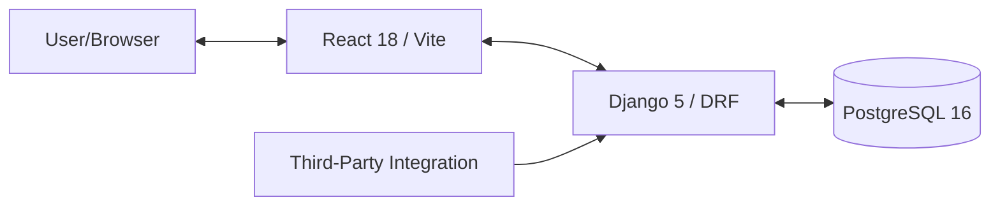

# TodoApp — Full-Stack Python/React Application

A production-quality To-Do List web application with advanced features like task sharing, categories, and public statistics.

## 1. Architecture Overview



- **Backend**: Python 3.12, Django 5, Django REST Framework, SimpleJWT (Auth), PostgreSQL.
- **Frontend**: React 18, TypeScript, Axios, React Query, Tailwind CSS, Lucide Icons.
- **Testing**: Pytest (Backend), Selenium + Pytest (Frontend E2E).
- **Infrastructure**: Docker, Docker Compose, GitHub Actions (CI/CD).

## 2. Prerequisites

- Docker and Docker Compose
- Node.js 18+ (for local development)
- Python 3.12 (for local development)

## 3. How to Run Locally

### Using Docker (Recommended)

1. Clone the repository.
2. Create a `.env` file in the root directory (refer to `.env.example`).
3. Run the following command:
   ```bash
   docker-compose up --build
   ```
4. (Optional) Seed the database with initial data:
   ```bash
   docker-compose run --rm backend python manage.py seed_db
   ```
   *Alternatively, you can start the app with seeding enabled by setting an environment variable:*
   ```bash
   SEED_DB=true docker-compose up --build
   ```
5. Access the frontend at `http://localhost:3000` and the backend at `http://localhost:8000`.
   *If you seeded the database, you can log in with:*
   - **Email**: `dev@example.com`
   - **Password**: `password123`

### Local Development (without Docker)

**Backend:**
```bash
cd backend
python -m venv venv
source venv/bin/activate
pip install -r requirements.txt
python manage.py migrate
python manage.py runserver
```

**Frontend:**
```bash
cd frontend
npm install
npm run dev
```

## 4. How to Run Tests

### Backend Tests
```bash
cd backend
pytest --cov=apps
```

### Frontend E2E Tests
```bash
cd frontend/tests
pytest test_e2e.py
```

## 5. External API Documentation

**Endpoint:** `GET /api/external/stats/`
Returns global aggregate statistics. No authentication required.

**Example Request:**
```bash
curl http://localhost:8000/api/external/stats/
```

**Example Response:**
```json
{
  "total_tasks": 100,
  "completed_tasks": 45,
  "completion_rate": 45.0,
  "top_categories": [
    { "id": "uuid-1", "name": "Work", "task_count": 40 },
    { "id": "uuid-2", "name": "Personal", "task_count": 30 }
  ]
}
```

## 6. Environment Variables (`.env.example`)

```env
SECRET_KEY=your-secret-key
DEBUG=True
DATABASE_URL=postgres://todo_user:todo_password@db:5432/todoapp
ALLOWED_HOSTS=localhost,127.0.0.1,backend
CORS_ALLOWED_ORIGINS=http://localhost:3000
```

## 7. CI/CD Pipeline

The GitHub Actions pipeline (`.github/workflows/ci.yml`) triggers on every push and PR to the `main` branch:

1. **Linting**: Checks Python (ruff/black) and React (eslint/prettier) code style.
2. **Backend Tests**: Runs pytest with coverage (must be > 80%).
3. **Frontend Tests**: Executes Selenium E2E tests in a Docker Compose environment.
4. **Build & Push**: Builds Docker images and pushes to GHCR (only on `push` to `main`).
5. **Deploy**: Automatically deploys the latest version to AWS EC2 on push to `main`.

## 8. Deploy (AWS EC2)

### Prerequisites
- AWS EC2 instance (t2.micro is sufficient) running Ubuntu/Amazon Linux.
- Security Group rules: Allow SSH (22), HTTP (80), and HTTPS (443).
- Docker and Docker Compose (V2) installed on the server.
- The server must be logged in to GHCR to pull private images (if applicable):
  ```bash
  echo <YOUR_GITHUB_TOKEN> | docker login ghcr.io -u <YOUR_GITHUB_USERNAME> --password-stdin
  ```

### GitHub Secrets to Configure
Set these secrets in your GitHub repository (Settings > Secrets and variables > Actions):
- `EC2_HOST`: The public IP or DNS of your EC2 instance.
- `EC2_USER`: The SSH username (e.g., `ubuntu` or `ec2-user`).
- `EC2_SSH_KEY`: The content of your private SSH key (`.pem` file).
- `POSTGRES_PASSWORD`: Production password for the database.
- `SECRET_KEY`: Production Django secret key.

### One-time Server Setup
```bash
# Update and install Docker
sudo apt-get update
sudo apt-get install ca-certificates cursor-utils curl gnupg
# ... follow official docker installation steps for your distro ...
# Add your user to the docker group to run without sudo
sudo usermod -aG docker $USER && newgrp docker
```

## 9. Design Decisions

- **JWT Auth**: Used for stateless authentication, with `SimpleJWT` providing access and refresh token logic.
- **UUID PKs**: Used for all models (User, Category, Task) for security and better scalability in distributed systems.
- **React Query**: Chosen for powerful server state management, caching, and optimistic updates for toggling task completion.
- **Page Object Model (POM)**: Applied in Selenium tests for better maintainability and readability.
- **Multi-stage Docker Builds**: Optimized for performance and security in production images.
