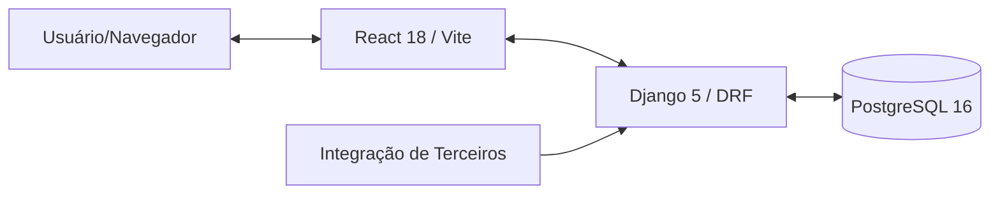

# TodoApp — Aplicação Full-Stack Python/React

Uma aplicação web de lista de tarefas com qualidade de produção, apresentando recursos avançados como compartilhamento de tarefas, categorias e estatísticas públicas.

## 1. Visão Geral da Arquitetura



- **Backend**: Python 3.12, Django 5, Django REST Framework, SimpleJWT (Autenticação), PostgreSQL, drf-spectacular (OpenAPI).
- **Frontend**: React 18, TypeScript, Axios, React Query, Tailwind CSS, Lucide Icons, React Hook Form, i18next (Internacionalização).
- **Testes**: Pytest (Backend), Selenium + Pytest (Frontend E2E).
- **Infraestrutura**: Docker, Docker Compose, GitHub Actions (CI/CD).

## 2. Funcionalidades

- **Autenticação**: Login e registro seguros baseados em JWT.
- **Gerenciamento de Tarefas**: Criar, atualizar, excluir e alternar status das tarefas.
- **Categorias**: Organize tarefas com categorias personalizadas.
- **Compartilhamento de Tarefas**: Compartilhe tarefas com outros usuários do sistema.
- **Perfil do Usuário**: Atualize informações de perfil, mude o nome de usuário e a senha.
- **Busca**: Pesquise outros usuários para compartilhar tarefas.
- **Internacionalização (i18n)**: Suporte para Inglês e Português.
- **Suporte a Temas**: Opções de modo claro e escuro.
- **Documentação da API**: Swagger UI e ReDoc interativos.
- **Design Responsivo**: Construído com Tailwind CSS para dispositivos móveis e desktop.

## 3. Pré-requisitos

- Docker e Docker Compose
- Node.js 18+ (para desenvolvimento local)
- Python 3.12 (para desenvolvimento local)

## 4. Como Executar Localmente

### Usando Docker (Recomendado)

1. Clone o repositório.
2. Crie um arquivo `.env` na raiz do diretório (consulte `.env.example`).
3. Execute o seguinte comando:
   ```bash
   docker-compose up --build
   ```
4. Acesse o frontend em `http://localhost:3000` e o backend em `http://localhost:8000`.
   - **Swagger UI**: `http://localhost:8000/api/docs/swagger-ui/`
   - **ReDoc**: `http://localhost:8000/api/docs/redoc/`
   - **Login Padrão (Semeado automaticamente)**:
     - **Desenvolvedor**: `dev@example.com` / `password123`
     - **Tester**: `tester@example.com` / `password123`
     - **Gerente**: `manager@example.com` / `password123`
5. (Opcional) Semeie o banco de dados manualmente se necessário:
   ```bash
   docker-compose run --rm backend python manage.py seed_db
   ```

### Desenvolvimento Local (sem Docker)

**Backend:**
```bash
cd backend
python -m venv venv
source venv/bin/activate
pip install -r requirements.txt
python manage.py migrate
python manage.py runserver
```

**Frontend:**
```bash
cd frontend
npm install
npm run dev
```

## 5. Como Executar os Testes

### Testes de Backend
```bash
cd backend
pytest --cov=apps
```

### Testes de Frontend E2E
```bash
cd frontend/tests
pytest test_e2e.py
```

## 6. Documentação da API

O projeto utiliza `drf-spectacular` para gerar esquemas OpenAPI 3.0. Com o backend em execução, você pode acessar a documentação interativa em:

- **Swagger UI**: [http://localhost:8000/api/docs/swagger-ui/](http://localhost:8000/api/docs/swagger-ui/)
- **ReDoc**: [http://localhost:8000/api/docs/redoc/](http://localhost:8000/api/docs/redoc/)
- **Esquema (YAML)**: [http://localhost:8000/api/schema/](http://localhost:8000/api/schema/)

## 7. Documentação da API Externa

**Endpoint:** `GET /api/external/stats/`
Retorna estatísticas agregadas globais. Nenhuma autenticação é necessária.

**Exemplo de Requisição:**
```bash
curl http://localhost:8000/api/external/stats/
```

**Exemplo de Resposta:**
```json
{
  "total_tasks": 100,
  "completed_tasks": 45,
  "completion_rate": 45.0,
  "top_categories": [
    { "id": "uuid-1", "name": "Work", "task_count": 40 },
    { "id": "uuid-2", "name": "Personal", "task_count": 30 }
  ]
}
```

## 8. Variáveis de Ambiente (`.env.example`)

```env
SECRET_KEY=your-secret-key
DEBUG=True
DATABASE_URL=postgres://todo_user:todo_password@db:5432/todoapp
ALLOWED_HOSTS=localhost,127.0.0.1,backend
CORS_ALLOWED_ORIGINS=http://localhost:3000
```

## 9. Pipeline CI/CD

O pipeline do GitHub Actions (`.github/workflows/ci.yml`) é acionado em cada push e PR para a branch `main`:

1. **Linting**: Verifica o estilo de código Python (ruff/black) e React (eslint/prettier).
2. **Testes de Backend**: Executa pytest com cobertura (deve ser > 80%).
3. **Testes de Frontend**: Executa testes Selenium E2E em um ambiente Docker Compose.
4. **Build & Push**: Constrói imagens Docker e as envia para o GHCR (somente em `push` para `main`).
5. **Deploy**: Implanta automaticamente a versão mais recente no AWS EC2 ao realizar o push para `main`.

## 10. Implantação (AWS EC2)

### Pré-requisitos
- Instância AWS EC2 (t2.micro é suficiente) executando Ubuntu/Amazon Linux.
- Regras do Grupo de Segurança: Permitir SSH (22), HTTP (80) e HTTPS (443).
- Docker e Docker Compose (V2) instalados no servidor.
- O servidor deve estar logado no GHCR para baixar imagens privadas (se aplicável):
  ```bash
  echo <SEU_TOKEN_GITHUB> | docker login ghcr.io -u <SEU_USUARIO_GITHUB> --password-stdin
  ```

### Segredos do GitHub para Configurar
Defina estes segredos no seu repositório GitHub (Configurações > Segredos e variáveis > Actions):
- `EC2_HOST`: O IP público ou DNS da sua instância EC2.
- `EC2_USER`: O nome de usuário SSH (ex: `ubuntu` ou `ec2-user`).
- `EC2_SSH_KEY`: O conteúdo da sua chave SSH privada (arquivo `.pem`).
- `POSTGRES_PASSWORD`: Senha de produção para o banco de dados.
- `SECRET_KEY`: Chave secreta de produção do Django.

### Configuração Única do Servidor
```bash
# Atualizar e instalar Docker
sudo apt-get update
sudo apt-get install ca-certificates cursor-utils curl gnupg
# ... siga os passos oficiais de instalação do Docker para sua distribuição ...
# Adicione seu usuário ao grupo docker para executar sem sudo
sudo usermod -aG docker $USER && newgrp docker
```

## 11. Decisões de Design

- **Autenticação JWT**: Utilizada para autenticação sem estado, com `SimpleJWT` fornecendo a lógica de tokens de acesso e renovação.
- **UUID PKs**: Utilizados em todos os modelos (Usuário, Categoria, Tarefa) para segurança e melhor escalabilidade em sistemas distribuídos.
- **React Query**: Escolhido para um gerenciamento poderoso do estado do servidor, cache e atualizações otimistas para alternar a conclusão de tarefas.
- **Internacionalização (i18n)**: Implementada usando `i18next` e `react-i18next` com detecção de idioma do navegador.
- **Page Object Model (POM)**: Aplicado nos testes Selenium para melhor manutenção e legibilidade.
- **Docker de Múltiplos Estágios (Multi-stage Builds)**: Otimizado para desempenho e segurança em imagens de produção.
