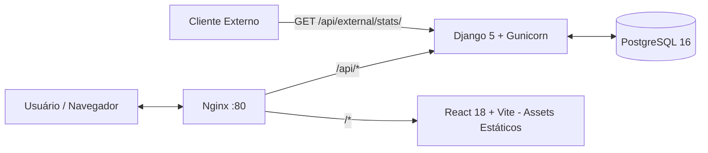

# TodoApp

> Aplicação web full-stack de gerenciamento de tarefas com autenticação JWT, compartilhamento entre usuários, categorias, API pública e deploy automatizado na AWS.

**🌐 Produção:** http://18.117.222.176

---

## Índice

1. [Visão Geral](#1-visão-geral)
2. [Funcionalidades](#2-funcionalidades)
3. [Arquitetura](#3-arquitetura)
4. [Stack](#4-stack)
5. [Rodando Localmente](#5-rodando-localmente)
6. [Variáveis de Ambiente](#6-variáveis-de-ambiente)
7. [Testes](#7-testes)
8. [API](#8-api)
9. [CI/CD](#9-cicd)
10. [Deploy AWS EC2](#10-deploy-aws-ec2)
11. [Decisões de Design](#11-decisões-de-design)

---

## 1. Visão Geral

TodoApp é uma aplicação de lista de tarefas com qualidade de produção, construída com Django REST Framework no backend e React 18 no frontend. O projeto atende a todos os requisitos do teste prático da Bravi, incluindo o ponto extra de deploy em nuvem (AWS EC2).

Credenciais de acesso pré-cadastradas para avaliação:

| Usuário | E-mail | Senha |
|---|---|---|
| Desenvolvedor | dev@example.com | password123 |
| Tester | tester@example.com | password123 |
| Gerente | manager@example.com | password123 |

---

## 2. Funcionalidades

- **Autenticação** — registro, login e refresh via JWT (access + refresh tokens)
- **Tarefas** — CRUD completo com infinite scroll, toggle de conclusão e atualização otimista
- **Categorias** — criação e gerenciamento de categorias por usuário
- **Compartilhamento** — compartilhe tarefas com outros usuários por e-mail
- **Filtros** — por status, prioridade, categoria, intervalo de datas e busca por texto
- **Perfil** — atualização de nome, e-mail e senha
- **API Pública** — endpoint de estatísticas globais sem autenticação (`/api/external/stats/`)
- **Documentação da API** — Swagger UI e ReDoc gerados automaticamente via drf-spectacular
- **Internacionalização** — suporte a Português e Inglês com detecção automática pelo navegador
- **Temas** — modo claro e escuro
- **Design responsivo** — mobile e desktop via Tailwind CSS

---

## 3. Arquitetura



O Nginx atua como ponto de entrada único na porta 80, roteando:
- requisições `/api/*` para o backend Django via Gunicorn
- todo o restante para os assets estáticos do React

Toda a orquestração é feita via Docker Compose em rede isolada.

---

## 4. Stack

| Camada | Tecnologias |
|---|---|
| Backend | Python 3.12, Django 5, Django REST Framework, SimpleJWT, drf-spectacular, PostgreSQL 16 |
| Frontend | React 18, TypeScript, Vite, Axios, React Query, React Hook Form, Tailwind CSS, i18next |
| Testes | pytest, pytest-django, pytest-cov, Selenium, webdriver-manager |
| Infra | Docker, Docker Compose, Nginx, Gunicorn, GitHub Actions, AWS EC2 |

---

## 5. Rodando Localmente

### Pré-requisitos

- Docker e Docker Compose instalados

### Com Docker (recomendado)

```bash
git clone https://github.com/[seu-usuario]/todoapp.git
cd todoapp
docker-compose up --build
```

O banco é migrado e semeado automaticamente na primeira execução. Nenhuma configuração manual de `.env` é necessária para o ambiente de desenvolvimento — o `docker-compose.yml` já inclui valores padrão seguros.

| Serviço | URL |
|---|---|
| Frontend | http://localhost:3000 |
| Backend | http://localhost:8000 |
| Swagger UI | http://localhost:8000/api/docs/swagger-ui/ |
| ReDoc | http://localhost:8000/api/docs/redoc/ |

Para popular o banco manualmente:

```bash
docker-compose run --rm backend python manage.py seed_db
```

### Sem Docker (desenvolvimento local)

**Backend:**

```bash
cd backend
python -m venv venv
source venv/bin/activate  # Windows: venv\Scripts\activate
pip install -r requirements.txt
cp .env.example .env      # edite conforme necessário
python manage.py migrate
python manage.py runserver
```

**Frontend:**

```bash
cd frontend
npm install
npm run dev
```

---

## 6. Variáveis de Ambiente

Copie `.env.example` para `.env` e ajuste os valores para desenvolvimento local sem Docker:

```env
# Django
SECRET_KEY=your-very-long-random-secret-key
DEBUG=True
ALLOWED_HOSTS=localhost,127.0.0.1,backend

# Banco de dados
DATABASE_URL=postgres://todo_user:todo_password@db:5432/todoapp

# CORS
CORS_ALLOWED_ORIGINS=http://localhost:3000
```

Para gerar um `SECRET_KEY` seguro:

```bash
python -c "import secrets; print(secrets.token_urlsafe(50))"
```

> ⚠️ Nunca suba o arquivo `.env` com credenciais reais para o repositório. O `.gitignore` já o exclui por padrão.

---

## 7. Testes

### Backend (pytest)

```bash
cd backend
pytest --cov=apps
```

A cobertura mínima exigida no CI é **80%**.

### Frontend E2E (Selenium)

**A. Dentro do Docker (headless — mesmo ambiente do CI):**

```bash
docker exec todoapp_backend pytest /app/frontend_tests/test_e2e.py
```

**B. Com navegador local (WSL / Desktop):**

```bash
pip install selenium webdriver-manager pytest pytest-django

# Opcional: aponte para um navegador específico
export CHROME_BINARY_PATH="/mnt/c/Program Files/BraveSoftware/Brave-Browser/Application/brave.exe"

# Opcional: desative headless para ver o navegador na tela
export CHROME_HEADLESS=false

pytest frontend/tests/test_e2e.py -m e2e
```

Os testes E2E seguem o padrão **Page Object Model (POM)** para melhor manutenção e legibilidade.

---

## 8. API

### Documentação interativa

| Interface | URL (local) |
|---|---|
| Swagger UI | http://localhost:8000/api/docs/swagger-ui/ |
| ReDoc | http://localhost:8000/api/docs/redoc/ |
| Schema YAML | http://localhost:8000/api/schema/ |

### Endpoint público — estatísticas globais

Não requer autenticação. Ideal para integração com sistemas externos.

```
GET /api/external/stats/
```

**Exemplo:**

```bash
curl http://18.117.222.176/api/external/stats/
```

**Resposta:**

```json
{
  "total_tasks": 100,
  "completed_tasks": 45,
  "completion_rate": 45.0,
  "top_categories": [
    { "id": "uuid-1", "name": "Work", "task_count": 40 },
    { "id": "uuid-2", "name": "Personal", "task_count": 30 }
  ]
}
```

### Principais endpoints autenticados

| Método | Endpoint | Descrição |
|---|---|---|
| POST | /api/auth/register/ | Criar conta |
| POST | /api/auth/login/ | Login (retorna JWT) |
| POST | /api/auth/refresh/ | Renovar access token |
| GET | /api/auth/me/ | Perfil do usuário autenticado |
| GET/POST | /api/tasks/ | Listar e criar tarefas |
| GET/PUT/PATCH/DELETE | /api/tasks/{id}/ | Detalhe, edição e exclusão |
| POST | /api/tasks/{id}/toggle/ | Alternar conclusão |
| POST | /api/tasks/{id}/share/ | Compartilhar com outro usuário |
| GET/POST | /api/categories/ | Listar e criar categorias |
| GET | /api/external/stats/ | Estatísticas públicas |

---

## 9. CI/CD

O pipeline no GitHub Actions (`.github/workflows/ci.yml`) é disparado em todo push e PR para `main`:

```
push / PR → main
    │
    ├── lint         ruff + black (Python) · eslint + prettier (React)
    ├── test-backend pytest com cobertura mínima de 80%
    ├── test-e2e     Selenium headless via Docker Compose
    ├── build        Docker multi-stage → push para GHCR
    └── deploy       SSH → EC2 → docker compose pull + up (somente push em main)
```

---

## 10. Deploy AWS EC2

A aplicação está em produção em: **http://18.117.222.176**

### Infraestrutura

- **EC2 t2.micro** — Ubuntu, região us-east-1
- **Nginx** — proxy reverso + serving de assets estáticos na porta 80
- **Docker Compose** — orquestração de todos os serviços no servidor
- **GHCR** — imagens Docker armazenadas no GitHub Container Registry

### Segredos necessários no GitHub

Configure em *Settings → Secrets and variables → Actions*:

| Secret | Descrição |
|---|---|
| `EC2_HOST` | IP público da instância EC2 |
| `EC2_USER` | Usuário SSH (ex: `ubuntu`) |
| `EC2_SSH_KEY` | Conteúdo da chave SSH privada (.pem) |
| `POSTGRES_PASSWORD` | Senha de produção do banco de dados |
| `SECRET_KEY` | Chave secreta de produção do Django |
| `AWS_ACCESS_KEY_ID` | Credencial AWS (se usar CLI/CloudFormation) |
| `AWS_SECRET_ACCESS_KEY` | Credencial AWS (se usar CLI/CloudFormation) |

### Setup inicial da instância (uma vez)

```bash
# Na instância EC2
sudo apt update && sudo apt install -y docker.io docker-compose-plugin
sudo usermod -aG docker ubuntu
# Faça logout e login novamente para aplicar o grupo
```

---

## 11. Decisões de Design

**UUID como chave primária** — todos os modelos (User, Task, Category) usam UUID em vez de inteiros sequenciais, evitando enumeração de recursos e facilitando escalabilidade em sistemas distribuídos.

**JWT com SimpleJWT** — autenticação stateless com tokens de acesso de curta duração e refresh token de longa duração, eliminando a necessidade de sessões no servidor.

**Infinite scroll com `useInfiniteQuery`** — preferido à paginação por números de página para uma experiência de navegação mais fluida, especialmente em dispositivos móveis.

**Nginx como ponto de entrada único** — unifica frontend e backend sob a mesma porta (80), elimina problemas de CORS em produção e serve assets estáticos com alta eficiência.

**React Query para estado do servidor** — gerenciamento de cache, refetch automático e atualizações otimistas (toggle de conclusão de tarefa acontece instantaneamente na UI antes da confirmação do servidor).

**Multi-stage Docker builds** — imagens de produção significativamente menores e mais seguras, separando o ambiente de build do runtime.

**Page Object Model nos testes Selenium** — seletores e ações encapsulados por página, tornando os testes legíveis e fáceis de manter quando a UI muda.

**Split settings (base / dev / prod)** — configurações de ambiente separadas evitam que valores de desenvolvimento vaze para produção acidentalmente.

**i18n com i18next** — detecção automática do idioma do navegador com fallback para português, sem necessidade de configuração manual pelo usuário.

---

*Desenvolvido como teste prático para a vaga de Desenvolvedor Python na Bravi.*